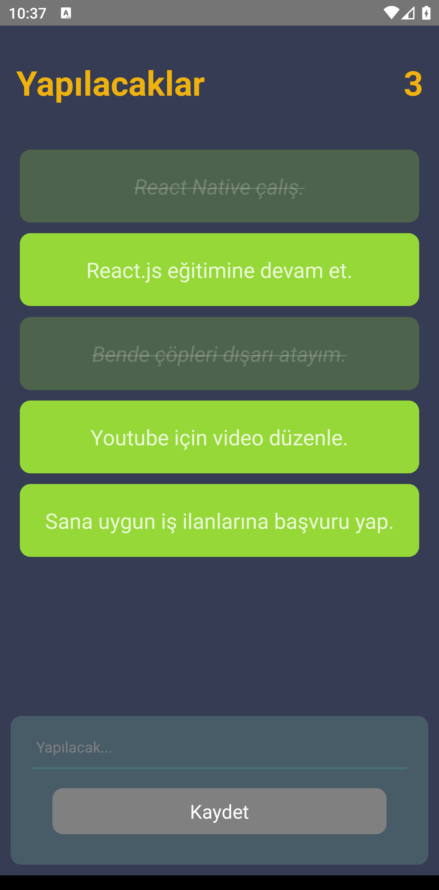
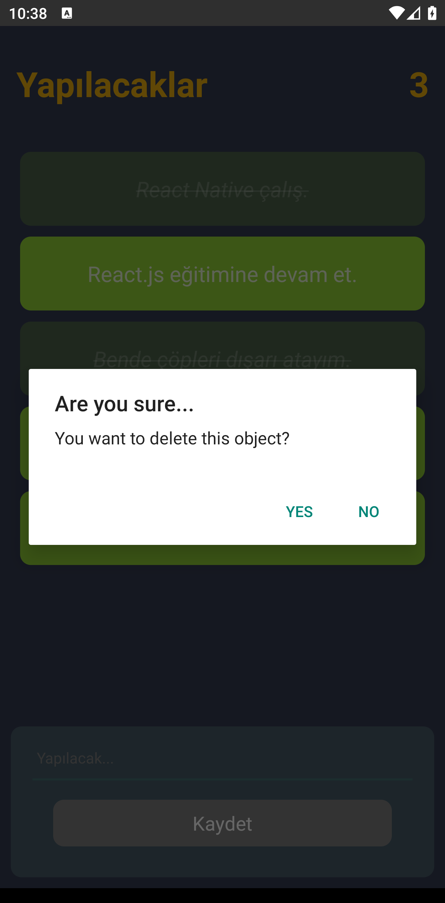
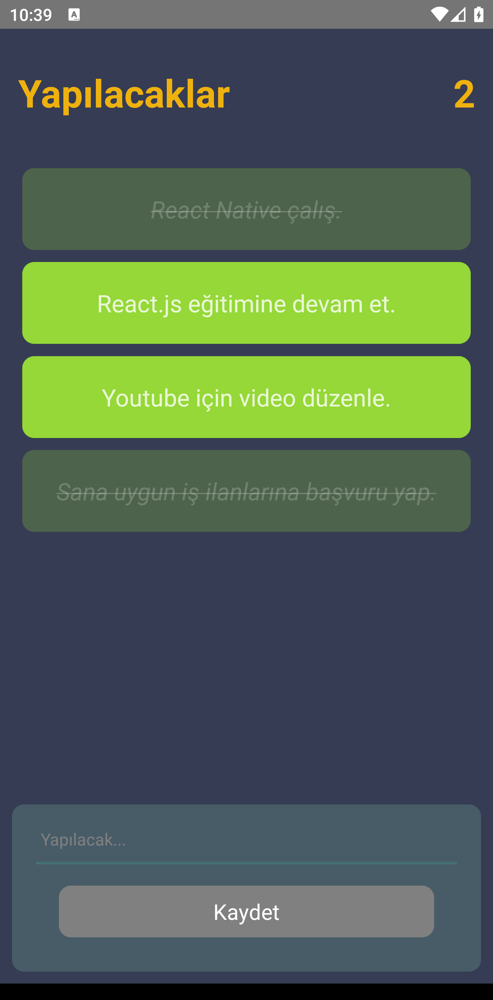

# README.md

To run my app, you can import "src" and "index.js" files to your project.

I developed ToDo app using react native framework. You can add new work to do, mark these work done and also delete them which you want.

-Screenshots from my app-

  
  
  

